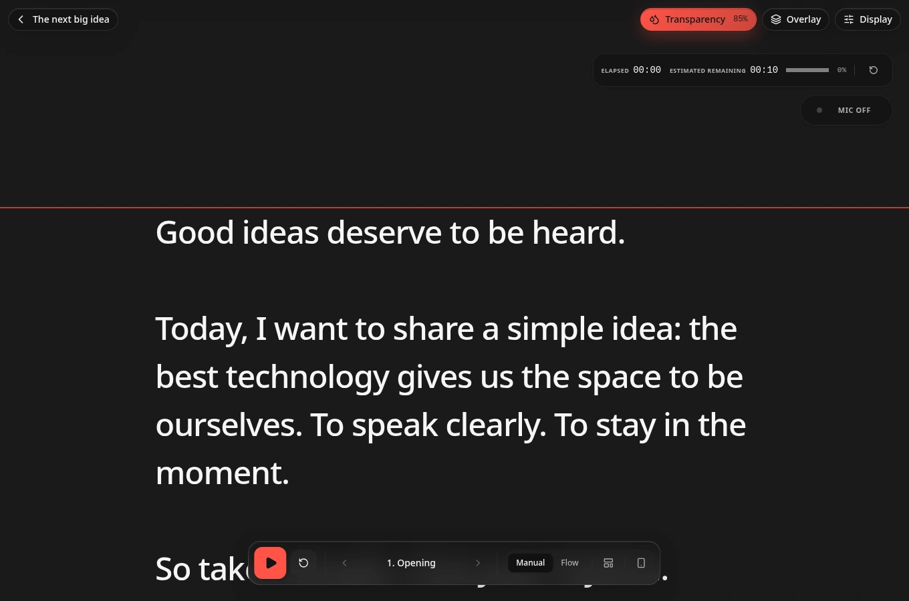

# Quickque

Quickque is a local-first teleprompter for live meetings: write a sectioned
script, keep your place while presenting, and pause without losing the thread.
The same reader runs in a browser and in a lightweight macOS desktop wrapper.



_Screenshot: Quickque reader in the browser preview; this is not evidence of
native macOS verification._

## Status

This repository is currently source-only. It does not claim a public production
site, a published installer, or a release download. The browser path can be
run from source. The macOS path is implemented in the source tree but
macOS-specific window, microphone, model, packaging, and phone behavior still
needs validation on supported hardware; a browser build is not proof of a
working Mac app.

## Source rights and optional packaged Mac app

Quickque's source code and documentation remain available under the [MIT
License](LICENSE), and source builds remain available using the commands below.
Separately, a proposed packaged Mac distribution is priced at **£77 as a
one-time purchase**. A purchased version is intended to remain usable forever;
future major upgrades may carry a separate charge. The price is for the
optional packaged distribution, not for permission to use the MIT-licensed
source.

There is no verified release or completed native Mac validation yet, so live
purchases remain gated. The dummy preview checkout creates neither a licence,
entitlement nor a download and no payment provider is configured. See the
[commerce runbook](artifacts/quickque-website/docs/COMMERCE.md) for the
current checkout boundary.

## Browser and Mac capabilities

| Capability | Browser source build | macOS source build |
| --- | --- | --- |
| Scripts and reader | Create scripts with **New script**, search title/section/body content, select visible scripts, use bulk actions, move items to Trash, and choose newest/oldest/title/custom order. | The same reader and local script library. |
| Presentation window | A normal browser page. A web page cannot reveal another app's window or reliably stay above Zoom or Meet. | A Tauri window can use the reader's transparent overlay mode, stay above ordinary windows, and appear across normal Spaces. macOS exclusive full-screen behavior is not guaranteed. |
| Flow | Manual reading only. | Optional local English speech guidance through the Apple Silicon Swift helper after an explicit model download; inference is offline after installation. |
| Documents and backups | Plain-text extraction from supported local files. **Export Full Backup** and **Import Backup JSON** manage the library backup. | The same features in the desktop webview. Native file-picker and Finder-drop behavior require Mac validation. |
| Phone remote | No local phone service. | Optional local-LAN phone remote served by the Mac; it is not a cloud relay or a public website. |

### Library and backups

Use **New script** to create a script. Library search covers the script title,
section titles, and section body content, not just titles. Select visible
scripts individually or with the visible select-all control, then use bulk
actions to export, move items to **Trash**, restore them, or delete Trash items
permanently. Trash has no automatic expiry. The library supports **Newest
First**, **Oldest First**, **Title A-Z**, **Title Z-A**, and **Custom Order**;
custom order can be changed by dragging scripts when the view is unfiltered.

**Export Full Backup** writes the current v2 JSON envelope. It includes live
scripts, Trash, the active selection, custom order, and sort mode (but not
presentation settings). **Import Backup JSON** is additive: current live and
Trash items remain, imported scripts and Trash entries are added, their script
and section IDs are remapped to avoid collisions, and the current active
selection and sort mode are preserved.
Legacy bare-array backups remain readable for migration, but they are not the
current full-backup format. Browser and desktop storage are separate, so export
a full backup before moving scripts between them. See
[privacy](artifacts/quickque-website/content/guide/privacy.json) and the
detailed [desktop notes](artifacts/quickque/DESKTOP.md).

## Quick start

Reproducible source work outside Replit uses Node.js 24, pnpm 10.26.1, and the
repository lockfile:

```sh
git clone https://github.com/rossboyd/quickque.git
cd quickque
pnpm install --frozen-lockfile
PORT=5173 BASE_PATH=/ pnpm --filter @workspace/quickque dev
```

The browser development server is the supported way to inspect the browser
reader. If you are already in a checkout, run `pnpm install --frozen-lockfile`
from its root. Build the Quickque browser bundle with the same explicit
artifact environment:

```sh
PORT=5173 BASE_PATH=/ pnpm --filter @workspace/quickque build
```

There is intentionally no one-size-fits-all root `pnpm run build` command for
external source work: workspace artifacts have different environment and
packaging requirements. Run the package command for the surface you are
building. The root typecheck remains useful for the shared workspace:

```sh
pnpm run typecheck
```

These are source commands, not a release or deployment recipe.

## Development and tests

Useful checks for the Quickque source are:

```sh
pnpm --filter @workspace/quickque typecheck
pnpm --filter @workspace/quickque test:flow
pnpm --filter @workspace/quickque test:remote
pnpm --filter @workspace/quickque test:document-import
pnpm --filter @workspace/quickque test:library
sh tests/remote-protocol/run.sh
```

The Swift package test requires macOS and the documented toolchain:

```sh
pnpm --filter @workspace/quickque native:test
```

The document-import parser limits and supported subsets are recorded in
[`PARSERS.md`](artifacts/quickque/src/lib/document-import/PARSERS.md). The
platform-neutral remote harness does not prove Mac firewall, camera, or
WKWebView behavior.

## Build the desktop source

Desktop development requires an Apple Silicon Mac running macOS 14 or newer,
Xcode 16 (including its Swift 6 toolchain), Xcode command-line tools, and the
stable Rust toolchain installed with `rustup`, in addition to Node.js 24 and
pnpm 10.26.1. Install the command-line tools if needed with
`xcode-select --install`. The canonical Mac source build below is generated
from [`config/site.json`](artifacts/quickque-website/config/site.json); keep
this block synchronized with that source command:

<!-- source-build:start -->
```sh
git clone https://github.com/rossboyd/quickque.git
cd quickque
pnpm install --frozen-lockfile
pnpm --filter @workspace/quickque desktop:build
```
<!-- source-build:end -->

`desktop:dev` is available after installation for interactive native
development, and `native:test` can be run before packaging:

```sh
pnpm --filter @workspace/quickque native:test
pnpm --filter @workspace/quickque desktop:dev
```

Both desktop commands build the Apple Silicon Flow helper first. Packaging,
model installation, permissions, local phone remote, signing, and
notarization details are in
[`artifacts/quickque/DESKTOP.md`](artifacts/quickque/DESKTOP.md). A local
unsigned build is not a verified release installer.

## Architecture and privacy

* The reader is a React/Vite application in `artifacts/quickque/src`.
* The desktop wrapper is Tauri 2 in `artifacts/quickque/src-tauri` and uses the
  macOS system webview rather than bundling a browser.
* Scripts, settings, and installed model data are local. There is no Quickque
  account, API key, cloud inference path, or server-side script store.
* Document import extracts bounded plain text locally. It does not render
  imported HTML or fetch resources embedded in a document.
* Local Flow uses the Swift helper and pinned upstream model sources. A user
  must explicitly download models; microphone input and recognition events are
  processed in memory and are not written as recordings.
* The phone remote is an optional, approval-gated service on a private LAN.
  It sends presentation controls and minimal reader state, not scripts, audio,
  or transcripts. Local HTTP is not encrypted, so the LAN must be trusted.

The native implementation and its validation limits are intentionally described
in detail in [`DESKTOP.md`](artifacts/quickque/DESKTOP.md). Do not infer Mac
verification from a browser preview or from Linux source inspection.

## Source guide

The website consumes these JSON files as its canonical guide source. Linking
the source files keeps this repository usable even when no production website
URL exists:

* [Requirements and installation](artifacts/quickque-website/content/guide/requirements-installation.json)
* [First presentation](artifacts/quickque-website/content/guide/first-presentation.json)
* [Scripts](artifacts/quickque-website/content/guide/scripts.json)
* [Document import](artifacts/quickque-website/content/guide/document-import.json)
* [Backup and restore](artifacts/quickque-website/content/guide/backup-restore.json)
* [Playback](artifacts/quickque-website/content/guide/playback.json)
* [Mac overlay](artifacts/quickque-website/content/guide/mac-overlay.json)
* [Local Flow](artifacts/quickque-website/content/guide/local-flow.json)
* [Phone remote](artifacts/quickque-website/content/guide/phone-remote.json)
* [Privacy](artifacts/quickque-website/content/guide/privacy.json)
* [Updating and uninstalling](artifacts/quickque-website/content/guide/updating-uninstalling.json)
* [Contributing](artifacts/quickque-website/content/guide/contributing.json)

## Contributing and licensing

Read [CONTRIBUTING.md](CONTRIBUTING.md) before opening a pull request. The
root [MIT License](LICENSE) covers Quickque-owned code and documentation only.
Bundled libraries, parser code, the FluidAudio integration, and model weights
retain their own terms; see
[THIRD_PARTY_NOTICES.md](THIRD_PARTY_NOTICES.md) and the notices shipped beside
the relevant source.

The canonical public source repository is
[`rossboyd/quickque`](https://github.com/rossboyd/quickque).